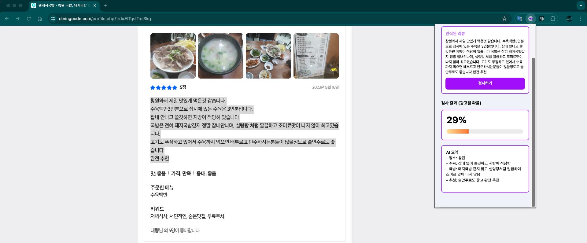

# Spotter Chrome Extension (Ad Detector + Gemini)

Lightweight guide to load the extension; backend is already running on GCP. Recommendation/cosine DB is not included.

## Model in use
The ad detector is an LSTM with self‑attention: tokens are embedded, an LSTM encodes the sequence, a learned attention matrix highlights impactful positions, and the weighted sequence feeds a linear layer to output the ad probability. Attention weights give interpretability by showing which words drove the decision.
**Language caution:** the model is trained on Korean-only data; analysis for other languages is unsupported and may be inaccurate.

## What’s in this repo
- Chrome extension UI (popup, background, content scripts).
- Backend client calls:
  - `/gemini` — summarizes the selected review text.
  - `/detect-ad` — returns ad likelihood (`prob_ad`).
- Recommendation endpoint is disabled; commented code is not part of this release.

## Load the extension in Chrome
1) Open `chrome://extensions/` and enable **Developer mode** (top-right toggle).  
2) Click **Load unpacked** and select this project folder (where `manifest.json` lives).  
3) Pin “Spotter” to the toolbar for quick access.

## Use it
1) Go to any page with reviews.  
2) Highlight the review text, then click the Spotter icon. The selected text appears in the popup.  
3) Press **Send**. The popup calls your backend and shows:
   - Gemini summary in the result box.
   - Ad likelihood score via the progress bar/number.

## Examples
For example, this was tested on the following dining review website (https://www.diningcode.com/profile.php?rid=EITqsITml3kq)
Popup view (analysis result):

Progress bar and summary update:

## Troubleshooting
- If you see “서버 오류”, confirm the backend URL in `popup.js` points to your deployed service and CORS is enabled there.
- Make sure your backend has `GOOGLE_API_KEY` set; without it `/gemini` returns 500.
- Recommendation requests will return HTTP 501 by design in this build.

## File map (frontend)
- `popup.html`, `popup.js`, `style.css` — extension UI.
- `background.js`, `contentScript.js` — tab interaction and text selection.
- `manifest.json` — extension manifest (Manifest V3).
